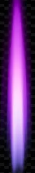

# 🐫 Camel Combat: Gtk3 Onslaught
An action-packed retro 2D vertical space shooter built entirely using **Perl 5**, **Gtk3** UI bindings, and **Cairo** vector graphics mapping layers.

---

## 🎨 Game Assets
Here are the custom sprite mechanics driving the space battlefield.

<table>
  <tr>
    <td align="center"><b>Player Ship</b></td>
    <td align="center"><b>Hostile Alien</b></td>
    <td align="center"><b>Laser Blast</b></td>
  </tr>
  <tr>
    <td></td>
    <td></td>
    <td></td>
  </tr>
</table>

---

## 👥 Credits & Development
* **Designed & Created By:** Aruna Hewapathirane
* **Engine Architecture:** Pathologically eclectant rubbish listing (*PERL*)

* **File Name:**    space_shooter.pl
* **Description:**  A 2D vertical arcade shooter using Gtk3 and Cairo graphics.
* **Author:**       Aruna Hewapathirane
* **Email:**        aruna.hewapathirane@gmail.com 
* **Created:**      2026-September-20
* **Version:**      1.0.0
* **Copyright:**    Copyright (c) 2026 Aruna. All rights reserved.
* **License:**      MIT License (or GNU GPLv3, etc.)
* **Repository:**   https://github.com

---

## 🎮 Game Controls
* **Any Key:** Start the game from the splash title screen.
* **Left Arrow:** Maneuver ship left.
* **Right Arrow:** Maneuver ship right.
* **Spacebar:** Hold or tap to discharge lasers.
* **R Key:** Instant game reset (use on *Game Over* or *Victory* screens).

---

## 🚀 Gameplay Rules & Progression
1. **Dodge the Horde:** Avoid letting incoming enemy ships touch your ship. One collision means instant destruction.
2. **Collect Points:** Blasting enemy minions awards **+10 points** to your dashboard.
3. **Level Up Every 100 Points:** Advance through 5 distinct level stages. As you climb, enemies shift colors using library blending arrays, spawn faster, and drop down quicker.
4. **Final Boss Encounter:** Crossing **400 points** triggers the Final Boss fight. Drain its health bar to secure total **Victory** and claim a **+1000 point completion bonus**!
5. **High Score Tracker:** Your all-time record is automatically written and stored in a local `highscore.txt` data file.

---

## 🛠️ Installation & Launch Setup

### 1. Install System Dependencies
Ensure your Linux machine (Debian/Ubuntu) has the proper Gtk3 development interpreters and sound compilation engines installed:
```bash
sudo apt-get update
sudo apt-get install libgtk3-perl libcairo-perl alsa-utils sox
```

### 2. Generate Your Sound FX
Run these quick synthetic macros in your project terminal to generate the high-quality native `.wav` files used by the sound system:
```bash
sox -n -r 11025 -c 1 fire.wav synth 0.5 sine 2200-800 fade q 0.01 0.5 0.4
sox -n -r 11025 -c 1 explosion.wav synth 0.3 whitenoise lowpass 1200 fade q 0.01 0.3 0.25
```

### 3. Run the Game!
Ensure your `player.png`, `enemy.png`, and `laser.png` pictures are inside the folder, then boot the script:
```bash
chmod +x space_shooter.pl
./space_shooter.pl
```

### Or
```bash
perl space_shooter.pl
```


</br></br>


Here are the instructions to play Shooter. You can print these out or keep them handy while playing!

🎮 Game Controls
Any Key        : Press any keyboard key on the opening splash screen to start the game.
Left Arrow Key : Move your spaceship to the left.
Right Arrow Key: Move your spaceship to the right.
Spacebar       : Hold or tap to fire your laser cannon.
R Key          : Press this to instantly restart the game if you hit a Game Over or achieve Victory.

🚀 Gameplay Rules & Objectives
Survive the Onslaught: Avoid letting enemy ships touch your spaceship. 
A single collision results in an instant Game Over.

Destroy the Enemy: Shoot incoming enemies to score points. 
Each minion destroyed is worth +10 points.
Level Up (Every 100 Points): 
The game features 5 Levels. 
Every time you pass a 100-point milestone (100, 200, 300, 400), the game advances:Enemies will change color to indicate a new level tier.
Enemies will spawn faster and move down the screen quicker.

The Final Boss Fight (Level 5): 
Once you cross 400 points, a massive, high-health Boss ship will descend from the top of the screen.
The boss moves back and forth horizontally, shielding its minions.
You must hit the boss 50 times to drain its red health pool bar.Defeating the Boss awards a +1000 point legendary bonus and secures your ultimate Victory!
